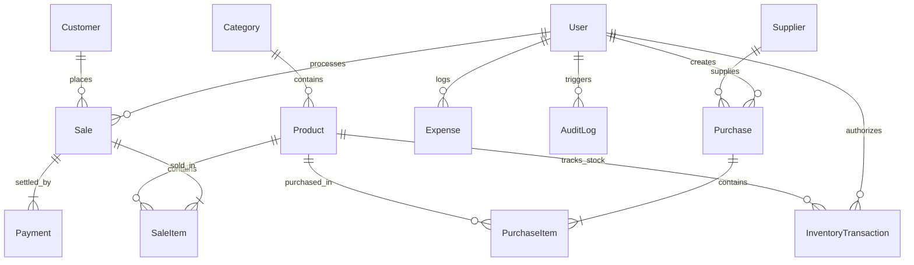

# SmartStock – Database Design & Architecture Specification

This document provides the complete technical specification of the PostgreSQL database schema for **SmartStock – Smart Inventory & Sales Analytics Platform**, implemented using Prisma ORM.

---

## 📐 Entity Relationship Diagram (ERD)

---

## 🗂️ Data Models & Schema Reference

### 1. `User` (Authentication & Access Control)
Stores system users with Role-Based Access Control (RBAC).

| Field | Type | Attributes | Description |
|-------|------|------------|-------------|
| `id` | String | `@id @default(uuid())` | Primary Key |
| `email` | String | `@unique` | Unique login identifier |
| `passwordHash` | String | - | Bcrypt hashed password (never exposed) |
| `name` | String | - | Full display name |
| `role` | UserRole | `@default(CASHIER)` | `ADMIN`, `MANAGER`, or `CASHIER` |
| `phone` | String | Optional | Contact phone number |
| `isActive` | Boolean | `@default(true)` | Account status flag |
| `createdAt` | DateTime | `@default(now())` | Record creation timestamp |
| `updatedAt` | DateTime | `@updatedAt` | Automatic update timestamp |

**Indexes:** `@@index([role])`

---

### 2. `Category` (Product Hierarchy)
Organizes products into logical business categories.

| Field | Type | Attributes | Description |
|-------|------|------------|-------------|
| `id` | String | `@id @default(uuid())` | Primary Key |
| `name` | String | `@unique` | Category display title |
| `slug` | String | `@unique` | URL-friendly slug identifier |
| `description` | String | Optional | Category notes / metadata |
| `createdAt` | DateTime | `@default(now())` | Creation timestamp |
| `updatedAt` | DateTime | `@updatedAt` | Update timestamp |

---

### 3. `Product` (Stock Catalog)
Master catalog of tracked items and prices.

| Field | Type | Attributes | Description |
|-------|------|------------|-------------|
| `id` | String | `@id @default(uuid())` | Primary Key |
| `categoryId` | String | Foreign Key -> `Category.id` | Associated category |
| `name` | String | - | Product commercial name |
| `sku` | String | `@unique` | Stock Keeping Unit identifier |
| `description` | String | Optional | Product specifications |
| `purchasePrice` | Decimal | `@db.Decimal(12, 2)` | Cost price per unit |
| `sellingPrice` | Decimal | `@db.Decimal(12, 2)` | Retail selling price per unit |
| `currentStock` | Int | `@default(0)` | Real-time available physical stock |
| `reorderLevel` | Int | `@default(10)` | Low-stock alert threshold |
| `unit` | String | `@default("pcs")` | Unit of measure (`pcs`, `box`, `kg`, etc.) |
| `status` | ProductStatus | `@default(ACTIVE)` | `ACTIVE`, `INACTIVE`, `DISCONTINUED` |
| `createdAt` | DateTime | `@default(now())` | Creation timestamp |
| `updatedAt` | DateTime | `@updatedAt` | Update timestamp |

**Indexes:** `@@index([categoryId])`, `@@index([sku])`, `@@index([status])`

---

### 4. `Supplier` (Vendor Management)
Directory of vendors providing inventory stock.

| Field | Type | Attributes | Description |
|-------|------|------------|-------------|
| `id` | String | `@id @default(uuid())` | Primary Key |
| `code` | String | `@unique` | Vendor code (`SUP-001`) |
| `name` | String | - | Company commercial name |
| `contactPerson` | String | Optional | Account manager / representative |
| `email` | String | Optional | Billing / support email |
| `phone` | String | Optional | Contact phone number |
| `address` | String | Optional | Physical/Mailing address |
| `taxId` | String | Optional | Tax identification number |
| `isActive` | Boolean | `@default(true)` | Active status flag |

**Indexes:** `@@index([code])`

---

### 5. `Customer` (Client Profiles)
Tracks customer purchase records and credit limits.

| Field | Type | Attributes | Description |
|-------|------|------------|-------------|
| `id` | String | `@id @default(uuid())` | Primary Key |
| `code` | String | `@unique` | Customer code (`CUST-001`) |
| `name` | String | - | Customer name |
| `email` | String | Optional | Email address |
| `phone` | String | Optional | Phone number |
| `address` | String | Optional | Billing address |
| `creditLimit` | Decimal | `@default(0.00)` | Maximum credit ceiling |
| `totalSpent` | Decimal | `@default(0.00)` | Lifetime cumulative spend |

**Indexes:** `@@index([code])`, `@@index([phone])`

---

### 6. `Purchase` & `PurchaseItem` (Inventory Procurement)
Tracks supplier purchase orders and line items.

- `Purchase`: `id`, `purchaseOrderNumber` (unique), `supplierId`, `userId`, `totalAmount`, `status` (`PENDING`, `RECEIVED`, `CANCELLED`), `notes`.
- `PurchaseItem`: `id`, `purchaseId`, `productId`, `quantity`, `unitCost`, `subtotal`.

---

### 7. `Sale` & `SaleItem` (Point of Sale Transactions)
Atomic customer checkout records.

- `Sale`: `id`, `invoiceNumber` (unique), `customerId` (optional), `userId`, `subtotal`, `taxAmount`, `discountAmount`, `totalAmount`, `status` (`COMPLETED`, `REFUNDED`, `CANCELLED`), `notes`.
- `SaleItem`: `id`, `saleId`, `productId`, `quantity`, `unitPrice`, `subtotal`.

---

### 8. `Payment` (Financial Settlements)
Financial transaction receipts associated with sales.

| Field | Type | Attributes | Description |
|-------|------|------------|-------------|
| `id` | String | `@id @default(uuid())` | Primary Key |
| `saleId` | String | Foreign Key -> `Sale.id` | Target sale |
| `amount` | Decimal | `@db.Decimal(12, 2)` | Settled amount |
| `paymentMethod` | PaymentMethod | Enum | `CASH`, `CARD`, `BANK_TRANSFER`, `ONLINE` |
| `transactionRef` | String | Optional | External payment gateway / transaction ID |
| `paidAt` | DateTime | `@default(now())` | Payment timestamp |

---

### 9. `InventoryTransaction` (Stock Movement Audit Log)
Guarantees every stock increment or decrement is recorded.

| Field | Type | Attributes | Description |
|-------|------|------------|-------------|
| `id` | String | `@id @default(uuid())` | Primary Key |
| `productId` | String | Foreign Key -> `Product.id` | Target item |
| `userId` | String | Optional | User who executed transaction |
| `type` | TransactionType | Enum | `PURCHASE`, `SALE`, `RETURN`, `DAMAGE`, `ADJUSTMENT` |
| `quantity` | Int | Signed Int | Quantity (+ for add, - for deduction) |
| `stockBefore` | Int | Non-negative | Stock level prior to operation |
| `stockAfter` | Int | Non-negative | Stock level after operation |
| `referenceId` | String | Optional | Associated PO ID, Sale ID, or Audit ID |

---

### 10. `Expense` & `AuditLog`
- `Expense`: Tracks business overhead (`category`, `amount`, `description`, `expenseDate`, `userId`).
- `AuditLog`: System security & compliance trail (`userId`, `action`, `entity`, `entityId`, `details`, `ipAddress`).

---

## 🔒 Stock Integrity & Constraint Rules

1. **Non-Negative Stock Guarantee:** Business logic during POS checkout or stock adjustments verifies `currentStock >= quantity` before committing transactions.
2. **ACID Database Transactions:** POS sales and purchase orders execute inside `prisma.$transaction([])` blocks to ensure stock updates, sale records, and payments commit atomically or roll back completely on failure.
3. **Monetary Precision:** All monetary amounts use `@db.Decimal(12, 2)` to eliminate floating-point rounding errors.

---

## ⚙️ Development Demo Seed Data Summary

Running `npx prisma db seed` populates:
- **6 System Users:** 1 Admin (`admin@smartstock.com`), 2 Managers (`manager1@smartstock.com`, `manager2@smartstock.com`), 3 Cashiers (`cashier1@smartstock.com`, `cashier2@smartstock.com`, `cashier3@smartstock.com`). Default password: `SmartStock2026!`.
- **8 Categories:** Electronics, Office Supplies, Beverages, Groceries, Apparel, Hardware, Personal Care, Home Appliances.
- **30 Products:** Distributed across all 8 categories with realistic prices and stock levels.
- **10 Suppliers:** Complete vendor profiles.
- **50 Customers:** Client records (`CUST-001` to `CUST-050`).
- **Procurement & POS Data:** Sample Purchase Orders, POS Sales, Card/Cash Payments, Stock Movement Audit Records, Operational Expenses, and Audit Logs.
