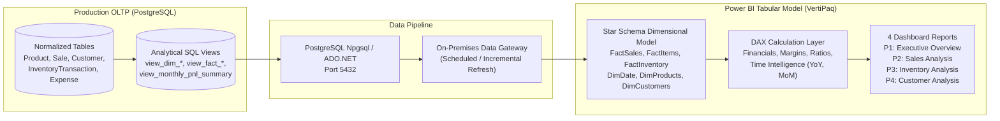
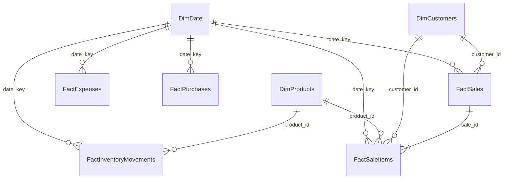

# 📊 SmartStock – Power BI Integration & Analytics Data Architecture Specification

This document provides the complete enterprise specification for integrating **SmartStock – Smart Inventory & Sales Analytics Platform** with **Microsoft Power BI**. 

It outlines the dimensional Star Schema, analytical SQL views, complete DAX calculation library, interactive visual configurations for all 4 core report pages, and data gateway refresh policies.

> **Zero Fake Data Policy**: All Power BI reports run directly against production PostgreSQL tables or optimized analytical SQL views (`view_*`) created in `analytics/powerbi/powerbi_views.sql`.

---

## 🏗️ 1. Architecture & Data Ingestion Strategy



### 1.1 DirectQuery vs. Import Mode Recommendation

| Dimension | Import Mode (Recommended) | DirectQuery Mode |
| :--- | :--- | :--- |
| **Performance** | **Sub-second (Ultra Fast)** cached in VertiPaq columnar memory | Query latency dependent on PostgreSQL workload |
| **DAX Capability** | Full DAX support (Time Intelligence: `SAMEPERIODLASTYEAR`, `TOTALYTD`) | Restricted DAX subset; some time-intelligence functions disabled |
| **Data Freshness** | Scheduled refresh (e.g., 4–8 times daily via Data Gateway) | Real-time (immediate reflection of every POS checkout) |
| **Recommendation** | **Primary Choice**: Import Mode provides instantaneous executive filtering and complex cohort analysis. | Use DirectQuery only for a dedicated "Live POS Terminal Activity" monitoring tile if needed. |

---

## 🔌 2. Database Connection Configuration

### 2.1 Connection Parameters
* **Server**: `localhost:5432` (or production RDS/PostgreSQL IP: `db.smartstock.internal:5432`)
* **Database**: `smartstock_db`
* **Data Connectivity Mode**: `Import`
* **Advanced Options / SQL Statement**: Connect directly to analytical views (`SELECT * FROM public.view_*`)

### 2.2 Power BI Desktop Connection Steps
1. Open **Power BI Desktop**.
2. Select **Get Data** $\rightarrow$ **Database** $\rightarrow$ **PostgreSQL database**.
3. In the dialog, enter:
   * **Server**: `localhost:5432`
   * **Database**: `smartstock_db`
   * **Data Connectivity mode**: `Import`
4. In the authentication prompt, select **Database** (Username/Password authentication):
   * **User name**: `postgres`
   * **Password**: `CJS@12345` (or production database credentials)
5. Select the **Navigator** window and check the 8 analytical views:
   * `view_dim_products`
   * `view_dim_customers`
   * `view_fact_sales`
   * `view_fact_sale_items`
   * `view_fact_inventory_movements`
   * `view_fact_expenses`
   * `view_fact_purchases`
   * `view_monthly_pnl_summary`

---

## 🗄️ 3. Star Schema Data Model

The recommended tabular data model adheres to Kimball Star Schema best practices. Fact tables represent transactional events, while Dimension tables provide filtering and grouping context.



### 3.1 Model Relationships & Cardinality

| From Table (Dimension) | From Column | To Table (Fact) | To Column | Cardinality | Cross Filter Direction | Active |
| :--- | :--- | :--- | :--- | :--- | :--- | :--- |
| `DimDate` | `DateKey` | `FactSales` | `date_key` | 1 to Many ($1:*$) | Single (Dim $\rightarrow$ Fact) | **Yes** |
| `DimDate` | `DateKey` | `FactSaleItems` | `date_key` | 1 to Many ($1:*$) | Single (Dim $\rightarrow$ Fact) | **Yes** |
| `DimDate` | `DateKey` | `FactInventoryMovements` | `date_key` | 1 to Many ($1:*$) | Single (Dim $\rightarrow$ Fact) | **Yes** |
| `DimDate` | `DateKey` | `FactExpenses` | `date_key` | 1 to Many ($1:*$) | Single (Dim $\rightarrow$ Fact) | **Yes** |
| `DimDate` | `DateKey` | `FactPurchases` | `date_key` | 1 to Many ($1:*$) | Single (Dim $\rightarrow$ Fact) | **Yes** |
| `DimProducts` | `product_id` | `FactSaleItems` | `product_id` | 1 to Many ($1:*$) | Single (Dim $\rightarrow$ Fact) | **Yes** |
| `DimProducts` | `product_id` | `FactInventoryMovements` | `product_id` | 1 to Many ($1:*$) | Single (Dim $\rightarrow$ Fact) | **Yes** |
| `DimCustomers` | `customer_id` | `FactSales` | `customer_id` | 1 to Many ($1:*$) | Single (Dim $\rightarrow$ Fact) | **Yes** |
| `DimCustomers` | `customer_id` | `FactSaleItems` | `customer_id` | 1 to Many ($1:*$) | Single (Dim $\rightarrow$ Fact) | **No** (Use Active via FactSales) |
| `FactSales` | `sale_id` | `FactSaleItems` | `sale_id` | 1 to Many ($1:*$) | Single (Sales $\rightarrow$ Items) | **Yes** |

---

## ⚡ 4. Analytical SQL Views Specification

Created in PostgreSQL using [`analytics/powerbi/powerbi_views.sql`](file:///e:/SmartStock%20%E2%80%93%20Smart%20Inventory%20&%20Sales%20Analytics%20Platform/analytics/powerbi/powerbi_views.sql):

### 1. `view_dim_products`
Enriched product dimension with category attributes, pricing margins, stock valuation, and operational health tagging (`OUT_OF_STOCK`, `LOW_STOCK`, `HEALTHY`, `OVERSTOCK`).
```sql
SELECT 
    p.id AS product_id, p.sku, p.name AS product_name, p."categoryId" AS category_id,
    c.name AS category_name, p.unit, p.status AS product_status,
    p."purchasePrice"::numeric(12,2) AS purchase_price,
    p."sellingPrice"::numeric(12,2) AS selling_price,
    (p."sellingPrice" - p."purchasePrice")::numeric(12,2) AS unit_margin,
    ROUND(((p."sellingPrice" - p."purchasePrice") / NULLIF(p."sellingPrice",0) * 100)::numeric, 2) AS target_margin_percent,
    p."currentStock" AS current_stock, p."reorderLevel" AS reorder_level,
    (p."currentStock" * p."purchasePrice")::numeric(12,2) AS stock_value_at_cost,
    (p."currentStock" * p."sellingPrice")::numeric(12,2) AS stock_value_at_retail,
    CASE 
        WHEN p."currentStock" <= 0 THEN 'OUT_OF_STOCK'
        WHEN p."currentStock" <= p."reorderLevel" THEN 'LOW_STOCK'
        WHEN p."currentStock" >= (p."reorderLevel" * 4) THEN 'OVERSTOCK'
        ELSE 'HEALTHY'
    END AS stock_health_status,
    p."createdAt" AS created_at
FROM "Product" p
LEFT JOIN "Category" c ON p."categoryId" = c.id;
```

### 2. `view_dim_customers`
Consolidates customer profile details with pre-aggregated lifetime value, order counts, and RFM behavioral segmentation tags.
```sql
SELECT 
    c.id AS customer_id, c.code AS customer_code, c.name AS customer_name,
    c.email, c.phone, c.address, c."creditLimit"::numeric(12,2) AS credit_limit,
    c."totalSpent"::numeric(12,2) AS total_spent,
    COUNT(s.id) AS total_orders,
    COALESCE(SUM(s."totalAmount"), 0)::numeric(12,2) AS calculated_lifetime_spend,
    CASE 
        WHEN COUNT(s.id) > 0 THEN ROUND((COALESCE(SUM(s."totalAmount"), 0) / COUNT(s.id))::numeric, 2)
        ELSE 0.00
    END AS avg_order_value,
    MAX(s."createdAt") AS last_order_date,
    CASE
        WHEN COUNT(s.id) >= 10 AND COALESCE(SUM(s."totalAmount"), 0) >= 2000 THEN 'VIP Champion'
        WHEN COUNT(s.id) >= 5 THEN 'High Value Loyal'
        WHEN COUNT(s.id) >= 2 THEN 'Repeat Regular'
        WHEN COUNT(s.id) = 1 THEN 'New / Single Order'
        ELSE 'Inactive'
    END AS customer_segment,
    c."createdAt" AS registration_date
FROM "Customer" c
LEFT JOIN "Sale" s ON c.id = s."customerId" AND s.status = 'COMPLETED'
GROUP BY c.id, c.code, c.name, c.email, c.phone, c.address, c."creditLimit", c."totalSpent", c."createdAt";
```

### 3. `view_fact_sales`
Order header grain containing total revenue, discounts, tax, calculated COGS, gross profit, and surrogate `date_key`.

### 4. `view_fact_sale_items`
Individual line item grain containing item quantity, unit price, unit cost, line COGS, and line gross profit for deep category/SKU analysis.

### 5. `view_fact_inventory_movements`
Materialized inventory delta movements containing signed and absolute unit quantities, valuation changes, and stock levels before/after.

### 6. `view_fact_expenses`
Operating business expenditures categorized by overhead type (Rent, Salaries, Utilities, Marketing, Logistics).

### 7. `view_fact_purchases`
Procurement orders received from external suppliers.

### 8. `view_monthly_pnl_summary`
Pre-aggregated executive monthly P&L balance table delivering instant query results for executive scorecards.

---

## 🧮 5. Recommended Power BI Measures (DAX Library)

Create a dedicated measure table in Power BI named `_Measures`.

### 5.1 Foundational Financial & P&L Measures

```dax
// 1. Total Revenue
Total Revenue = 
SUM(FactSales[total_revenue])

// 2. Total Cost of Goods Sold (COGS)
Total COGS = 
SUM(FactSaleItems[line_cogs])

// 3. Gross Profit
Gross Profit = 
[Total Revenue] - [Total COGS]

// 4. Gross Profit Margin %
Gross Margin % = 
DIVIDE([Gross Profit], [Total Revenue], 0)

// 5. Total Operating Expenses (OPEX)
Total Expenses = 
SUM(FactExpenses[expense_amount])

// 6. Net Profit (Bottom Line)
Net Profit = 
[Gross Profit] - [Total Expenses]

// 7. Net Profit Margin %
Net Margin % = 
DIVIDE([Net Profit], [Total Revenue], 0)
```

### 5.2 Volume & Order Performance Measures

```dax
// 8. Total Completed Orders
Total Orders = 
DISTINCTCOUNT(FactSales[sale_id])

// 9. Average Order Value (AOV)
Average Order Value = 
DIVIDE([Total Revenue], [Total Orders], 0)

// 10. Total Units Sold
Total Units Sold = 
SUM(FactSaleItems[quantity])

// 11. Units Per Transaction (Basket Depth)
Units Per Transaction = 
DIVIDE([Total Units Sold], [Total Orders], 0)
```

### 5.3 Time Intelligence & Growth Measures

```dax
// 12. Month-to-Date (MTD) Revenue
Revenue MTD = 
TOTALMTD([Total Revenue], DimDate[Date])

// 13. Year-to-Date (YTD) Revenue
Revenue YTD = 
TOTALYTD([Total Revenue], DimDate[Date])

// 14. Revenue Prior Month (PM)
Revenue PM = 
CALCULATE(
    [Total Revenue],
    DATEADD(DimDate[Date], -1, MONTH)
)

// 15. Month-over-Month (MoM) Revenue Growth ($)
Revenue MoM Growth $ = 
[Total Revenue] - [Revenue PM]

// 16. Month-over-Month (MoM) Revenue Growth (%)
Revenue MoM Growth % = 
DIVIDE([Revenue MoM Growth $], [Revenue PM], 0)

// 17. Revenue Prior Year (PY)
Revenue PY = 
CALCULATE(
    [Total Revenue],
    SAMEPERIODLASTYEAR(DimDate[Date])
)

// 18. Year-over-Year (YoY) Revenue Growth (%)
Revenue YoY Growth % = 
DIVIDE([Total Revenue] - [Revenue PY], [Revenue PY], 0)
```

### 5.4 Inventory & Turnover Measures

```dax
// 19. Current Units on Hand
Current Stock Units = 
SUM(DimProducts[current_stock])

// 20. Total Inventory Value (At Cost)
Inventory Valuation = 
SUM(DimProducts[stock_value_at_cost])

// 21. Total Inventory Value (At Retail Potential)
Inventory Retail Value = 
SUM(DimProducts[stock_value_at_retail])

// 22. Low Stock SKU Count
Low Stock SKUs = 
CALCULATE(
    COUNTROWS(DimProducts),
    DimProducts[stock_health_status] = "LOW_STOCK"
)

// 23. Out of Stock SKU Count
Out of Stock SKUs = 
CALCULATE(
    COUNTROWS(DimProducts),
    DimProducts[stock_health_status] = "OUT_OF_STOCK"
)

// 24. Dead Stock SKU Count (Zero units sold in selected period)
Dead Stock SKUs = 
CALCULATE(
    COUNTROWS(DimProducts),
    NOT(DimProducts[product_id] IN VALUES(FactSaleItems[product_id]))
)

// 25. Inventory Turnover Ratio
Inventory Turnover Ratio = 
DIVIDE([Total COGS], [Inventory Valuation], 0)

// 26. Days Sales of Inventory (DSI)
Days Sales of Inventory = 
DIVIDE(365, [Inventory Turnover Ratio], 0)

// 27. Net Stock Flow (Inflow vs Outflow)
Net Stock Flow Units = 
SUM(FactInventoryMovements[unit_delta])
```

### 5.5 Customer Analytics Measures

```dax
// 28. Total Registered Customers
Total Customers = 
DISTINCTCOUNT(DimCustomers[customer_id])

// 29. Active Transacting Customers (Period)
Active Customers = 
CALCULATE(
    DISTINCTCOUNT(FactSales[customer_id]),
    NOT(ISBLANK(FactSales[customer_id]))
)

// 30. Repeat Customers (> 1 Order)
Repeat Customers = 
CALCULATE(
    DISTINCTCOUNT(DimCustomers[customer_id]),
    DimCustomers[total_orders] > 1
)

// 31. Repeat Customer Retention Rate (%)
Repeat Customer Rate % = 
DIVIDE([Repeat Customers], [Total Customers], 0)

// 32. Average Spend per Customer
Average Customer Spend = 
DIVIDE([Total Revenue], [Active Customers], 0)
```

---

## 🖥️ 6. Four Dashboard Specifications

### 📄 PAGE 1 — Executive Overview
**Audience**: C-Suite, Managing Directors, Store Owners  
**Objective**: High-level financial health, profitability, and operational volume KPIs.

```
+-----------------------------------------------------------------------------------------------------+
| 🏷️ SMARTSTOCK — EXECUTIVE OVERVIEW                             [ Date Slicer: YTD / Last 90 Days ]   |
+-------------------+-------------------+-------------------+-------------------+---------------------+
| 💰 REVENUE        | 📈 GROSS PROFIT   | 🏆 NET PROFIT     | 📦 ORDERS         | 👥 CUSTOMERS        |
| $164,118.55       | $87,575.65 (53.4%)| $25,282.09 (15.4%)| 1,751             | 50 (100% Repeat)    |
| ▲ +18.2% vs PY    | ▲ +14.6% vs PY    | ▲ +22.1% vs PY    | ▲ +9.4% vs PY     | ▲ +12 New Accounts  |
+-------------------+-------------------+-------------------+-------------------+---------------------+
| [ Visual 1: Financial Waterfall (Revenue to Net) ]| [ Visual 2: Revenue vs Net Profit Monthly Trend ]|
| Revenue -> COGS -> Gross Profit -> OPEX -> Net   | Line & Clustered Column: Revenue Bars + Net Line    |
+---------------------------------------------------+-------------------------------------------------+
| [ Visual 3: Operating Expense Breakdown ]         | [ Visual 4: Monthly Executive P&L Scorecard ]   |
| Donut Chart: Payroll, Rent, Marketing, Utilities  | Table: Month | Revenue | COGS | OPEX | Net | %      |
+---------------------------------------------------+-------------------------------------------------+
```

#### Visual Configurations:
1. **5 KPI Cards (Top Banner)**:
   * **Card 1**: `[Total Revenue]`, subtitle: `[Revenue YoY Growth %]`.
   * **Card 2**: `[Gross Profit]`, subtitle: `[Gross Margin %]`.
   * **Card 3**: `[Net Profit]`, subtitle: `[Net Margin %]`.
   * **Card 4**: `[Total Orders]`, subtitle: `[Average Order Value]`.
   * **Card 5**: `[Total Customers]`, subtitle: `[Repeat Customer Rate %]`.
2. **Visual 1 — Financial P&L Waterfall Chart**:
   * **Type**: Waterfall Chart
   * **Category**: Breakdown dimension (`Revenue`, `COGS`, `Gross Profit`, `Operating Expenses`, `Net Profit`)
   * **Y-Axis**: Measures (`[Total Revenue]`, `-[Total COGS]`, `[Gross Profit]`, `-[Total Expenses]`, `[Net Profit]`)
   * **Sentiment Colors**: Green for additions/net profit, Red for deductions (COGS/OPEX).
3. **Visual 2 — Revenue & Net Profit Monthly Trend**:
   * **Type**: Line and Clustered Column Chart
   * **Shared X-Axis**: `DimDate[MonthYear]`
   * **Column Y-Axis**: `[Total Revenue]` (Light Blue `#0ea5e9`), `[Gross Profit]` (Green `#10b981`)
   * **Line Y-Axis**: `[Net Profit]` (Purple `#8b5cf6`), `[Net Margin %]` (Orange `#f97316`)
4. **Visual 3 — Operating Expense Distribution**:
   * **Type**: Donut Chart
   * **Legend**: `FactExpenses[expense_category]`
   * **Values**: `[Total Expenses]`
5. **Visual 4 — Executive Monthly P&L Matrix**:
   * **Type**: Matrix / Table
   * **Rows**: `DimDate[Year]`, `DimDate[Month]`
   * **Values**: `[Total Revenue]`, `[Total COGS]`, `[Gross Profit]`, `[Gross Margin %]`, `[Total Expenses]`, `[Net Profit]`, `[Net Margin %]`.

---

### 📄 PAGE 2 — Sales Analysis
**Audience**: Sales Managers, Category Leads  
**Objective**: Sales trajectory, product category performance, and seasonal sales growth.

```
+-----------------------------------------------------------------------------------------------------+
| 📈 SMARTSTOCK — SALES & REVENUE ANALYSIS                       [ Category Slicer ] [ Date Slicer ]   |
+-----------------------------------------------------------------------------------------------------+
| [ Visual 1: Daily Sales Trend & Moving Average ]                                                    |
| Area & Line Chart: Daily Sales Volume with 7-Day & 30-Day Moving Averages                           |
+---------------------------------------------------+-------------------------------------------------+
| [ Visual 2: Category Revenue & Volume ]           | [ Visual 3: Top 10 Best Sellers ]               |
| Clustered Bar: Total Revenue & Units Sold         | Horizontal Bar: Revenue by Product SKU          |
+---------------------------------------------------+-------------------------------------------------+
| [ Visual 4: Monthly Comparison & MoM Growth % ]   | [ Visual 5: Store Trading Hours Heatmap ]       |
| Clustered Column with MoM % Line Overlay          | Matrix Heatmap: Day of Week vs Hour of Day      |
+---------------------------------------------------+-------------------------------------------------+
```

#### Visual Configurations:
1. **Visual 1 — Daily Sales Trend & Moving Averages**:
   * **Type**: Line Chart
   * **X-Axis**: `DimDate[Date]`
   * **Y-Axis**: `[Total Revenue]`, `[7-Day Moving Avg]`, `[30-Day Moving Avg]`
   * **Formatting**: Soft area fill under daily revenue, solid bold line for 7-day trend.
2. **Visual 2 — Sales by Product Category**:
   * **Type**: Clustered Bar Chart
   * **Y-Axis**: `DimProducts[category_name]`
   * **X-Axis**: `[Total Revenue]`
   * **Tooltips**: `[Total Units Sold]`, `[Gross Margin %]`
3. **Visual 3 — Best Sellers Leaderboard**:
   * **Type**: Horizontal Bar Chart
   * **Y-Axis**: `DimProducts[product_name]` (Top 10 Filter by `[Total Revenue]`)
   * **X-Axis**: `[Total Revenue]`
   * **Data Labels**: Enabled (Currency formatted)
4. **Visual 4 — Monthly Comparison & Sales Growth**:
   * **Type**: Combo Chart (Clustered Column + Line)
   * **X-Axis**: `DimDate[MonthYear]`
   * **Column Values**: `[Total Revenue]`
   * **Line Values**: `[Revenue MoM Growth %]`
   * **Secondary Y-Axis**: Percentage scale with zero baseline.
5. **Visual 5 — Day-of-Week & Trading Hour Heatmap**:
   * **Type**: Matrix Table with Conditional Formatting
   * **Rows**: `DimDate[DayOfWeekName]` (Mon–Sun)
   * **Columns**: `FactSales[sale_hour]` (9 AM – 7 PM)
   * **Values**: `[Total Revenue]`
   * **Formatting**: Background color gradient (Light blue to Deep navy).

---

### 📄 PAGE 3 — Inventory Analysis
**Audience**: Operations Managers, Warehouse Supervisors, Procurement Officers  
**Objective**: Stock availability, low-stock alerts, dead stock capital, and stock turnover.

```
+-----------------------------------------------------------------------------------------------------+
| 🏭 SMARTSTOCK — INVENTORY HEALTH & VALUATION                   [ Category Filter ] [ Stock Status ] |
+-------------------+-------------------+-------------------+-------------------+---------------------+
| 🏷️ VALUATION (COST)| 📦 TOTAL UNITS    | ⚠️ LOW STOCK SKUS | 🛑 DEAD STOCK SKUS| ⚡ TURNOVER RATIO   |
| $20,013.00        | 2,390 Units       | 4 SKUs Alert      | 0 SKUs Dormant    | 3.82x (DSI: 47 Days)|
+-------------------+-------------------+-------------------+-------------------+---------------------+
| [ Visual 1: Stock Level vs Reorder Level ]        | [ Visual 2: Inventory Value by Category ]       |
| Bullet Chart: Current Units vs Min Threshold      | Treemap: Valuation at Cost                      |
+---------------------------------------------------+-------------------------------------------------+
| [ Visual 3: Slow-Moving & Low-Velocity Items ]    | [ Visual 4: Inbound vs Outbound Stock Movements]|
| Table: SKU | Name | Stock | Days Supply | Margin  | Stacked Area: Replenishments (+) vs Sales (-)   |
+---------------------------------------------------+-------------------------------------------------+
```

#### Visual Configurations:
1. **5 Operational Inventory KPI Cards**:
   * **Card 1**: `[Inventory Valuation]` (Valuation at Cost).
   * **Card 2**: `[Current Stock Units]`.
   * **Card 3**: `[Low Stock SKUs]` (Conditional Red Alert formatting).
   * **Card 4**: `[Dead Stock SKUs]` (Capital tied up in dormant inventory).
   * **Card 5**: `[Inventory Turnover Ratio]`, subtitle: `[Days Sales of Inventory]`.
2. **Visual 1 — Current Stock vs. Reorder Level (Deficit Detection)**:
   * **Type**: Clustered Bar / Bullet Chart
   * **Y-Axis**: `DimProducts[product_name]`
   * **X-Axis**: `DimProducts[current_stock]`
   * **Reference Line**: `DimProducts[reorder_level]`
   * **Conditional Formatting**: Red fill if `current_stock <= reorder_level`.
3. **Visual 2 — Capital Allocation by Category**:
   * **Type**: Treemap
   * **Group**: `DimProducts[category_name]`
   * **Values**: `[Inventory Valuation]`
4. **Visual 3 — Slow-Moving & High-Risk Inventory Table**:
   * **Type**: Table
   * **Columns**: `DimProducts[sku]`, `DimProducts[product_name]`, `DimProducts[category_name]`, `DimProducts[current_stock]`, `[Total Units Sold]`, `[Days Sales of Inventory]`, `DimProducts[stock_value_at_cost]`.
   * **Filter**: Bottom 10 by `[Total Units Sold]`.
5. **Visual 4 — Stock Inflow vs. Outflow Dynamics**:
   * **Type**: Clustered Column Chart
   * **X-Axis**: `DimDate[MonthYear]`
   * **Values**: `[Stock Inflow Units]` (Green), `[Stock Outflow Units]` (Red).

---

### 📄 PAGE 4 — Customer Analysis
**Audience**: Marketing Team, CRM Managers, Store Directors  
**Objective**: Customer lifetime spend, repeat purchasing retention, and RFM behavioral cohorts.

```
+-----------------------------------------------------------------------------------------------------+
| 👥 SMARTSTOCK — CUSTOMER BEHAVIOR & SEGMENTATION              [ Segment Slicer ] [ Spending Tier ]  |
+-------------------+-------------------+-------------------+-------------------+---------------------+
| 👥 TOTAL CUSTOMERS| 🔄 REPEAT BUYERS  | 💵 AVERAGE SPEND  | 🏷️ AVG ORDER VALUE| 🌟 TOP SPENDER      |
| 50 Accounts       | 50 (100.0% Rate)  | $3,282.37 / Client| $93.73 / Basket   | $9,906.37 (Sophia J)|
+-------------------+-------------------+-------------------+-------------------+---------------------+
| [ Visual 1: Customer Segmentation RFM Shares ]   | [ Visual 2: Top 10 Customers by Lifetime Spend ] |
| Donut Chart: VIP Champion, High Value, Regular    | Horizontal Bar: Spend ($) with Order Count Tag  |
+---------------------------------------------------+-------------------------------------------------+
| [ Visual 3: Customer Revenue Pareto Distribution ]| [ Visual 4: Order Frequency vs Spend Scatter ]  |
| 80/20 Cumulative Revenue vs % of Customer Base    | Scatter Plot: Orders (X) vs Lifetime Spend (Y)  |
+---------------------------------------------------+-------------------------------------------------+
```

#### Visual Configurations:
1. **5 Customer Intelligence KPI Cards**:
   * **Card 1**: `[Total Customers]`.
   * **Card 2**: `[Repeat Customers]`, subtitle: `[Repeat Customer Rate %]`.
   * **Card 3**: `[Average Customer Spend]`.
   * **Card 4**: `[Average Order Value]`.
   * **Card 5**: `Max Customer Spend` with Customer Name tag.
2. **Visual 1 — Customer Segmentation Distribution**:
   * **Type**: Donut Chart
   * **Legend**: `DimCustomers[customer_segment]` (`VIP Champion`, `High Value Loyal`, `Active Regular`, `At Risk`)
   * **Values**: `[Total Revenue]` (and secondary view with `[Total Customers]`)
3. **Visual 2 — Top 10 Customers by Total Spend**:
   * **Type**: Horizontal Bar Chart
   * **Y-Axis**: `DimCustomers[customer_name]` (Top 10 by `[Total Revenue]`)
   * **X-Axis**: `[Total Revenue]`
   * **Tooltips**: `DimCustomers[total_orders]`, `DimCustomers[avg_order_value]`
4. **Visual 3 — Revenue Pareto Distribution (80/20 Rule)**:
   * **Type**: Line and Clustered Column Chart
   * **X-Axis**: Ranked Customer Percentile
   * **Column Values**: Customer Spend ($)
   * **Line Values**: Cumulative Revenue % (with 80% horizontal reference line)
5. **Visual 4 — Customer Order Frequency vs. Spend (RFM Matrix)**:
   * **Type**: Scatter Plot
   * **X-Axis**: `DimCustomers[total_orders]`
   * **Y-Axis**: `DimCustomers[calculated_lifetime_spend]`
   * **Bubble Size**: `DimCustomers[avg_order_value]`
   * **Legend**: `DimCustomers[customer_segment]`

---

## 🎛️ 7. Slicers, Filters & Interactivity Model

### 7.1 Global Report-Level Slicers (Sync Slicers Pane)
Place these slicers in a unified collapsible side pane synchronized across all 4 report pages:
* **Date Range Slicer**: Relative Date Picker (`This Year`, `Last 90 Days`, `Last Month`, `Custom Calendar`).
* **Product Category Slicer**: Multi-select dropdown (`Electronics`, `Office Supplies`, `Groceries`, etc.).
* **Store Cashier / User**: Dropdown filter for staff tracking.

### 7.2 Drill-Through & Navigation Workflows
* **Product Drill-Through**: Right-clicking any product on Page 1 or Page 2 enables drill-through to a detailed **Product Inventory & Velocity Card** on Page 3.
* **Customer Drill-Through**: Right-clicking any customer in the Leaderboard on Page 4 enables drill-through to a **Customer Transaction History Ledger**.
* **Cross-Filtering**: All visuals on a page cross-filter each other (e.g. clicking "Electronics" in Visual 2 highlights only electronics products and customers in adjacent charts).

---

## 🔄 8. Data Refresh & Enterprise Governance

### 8.1 Refresh Strategy
* **Development / Local Evaluation**: Manual refresh in Power BI Desktop (`Home` $\rightarrow$ `Refresh`).
* **Production Power BI Service**:
  1. Install the **Microsoft On-Premises Data Gateway** (Standard Mode) on the server hosting PostgreSQL.
  2. Register the Gateway in Power BI Service (`Settings` $\rightarrow$ `Manage Connections and Gateways`).
  3. Configure scheduled refresh **4 times daily**:
     * `07:30 AM` (Pre-opening inventory sync)
     * `12:30 PM` (Midday sales sync)
     * `05:30 PM` (Late afternoon rush sync)
     * `09:30 PM` (End-of-day P&L reconciliation)

### 8.2 Incremental Refresh Policy (For Large Datasets)
For enterprise scaling beyond $1,000,000$ transactions:
* **Table**: `FactSaleItems` / `FactSales`
* **RangeStart / RangeEnd Parameters**: Filter `FactSales[sale_timestamp]`
* **Archive Period**: Store 3 Years of historical data
* **Refresh Period**: Incrementally refresh only the last 7 Days
* **Detect Data Changes**: Enable change detection on `Sale[updatedAt]` column

### 8.3 Role-Based Row-Level Security (RLS)
To align Power BI reports with SmartStock RBAC:
* **Role: `StoreCashier`**:
  ```dax
  [user_id] = USERPRINCIPALNAME()
  ```
  *(Restricts cashier view to their own processed sales transactions)*.
* **Role: `InventoryManager`**:
  Has full access to Page 2 and Page 3; restricted access to Operating Expenses on Page 1.
* **Role: `AdminExecutive`**:
  Full unconstrained access to all tables, expenses, and net profit margins.
